# API Security Hands-on Session

## Local Lab Setup 

### Pre-requisites :information_source:
In case you want to deploy the below described lab on your local machine, then you need to make sure that the below tools/packages are installed:
- **Docker Engine**. The lab will be deployed as a Docker container, so a Docker engine is a must have. :smiley:
The easiest way is to install Docker Desktop :
  - [Install Docker Desktop on Mac](https://docs.docker.com/docker-for-mac/install/)
  - [Install Docker Desktop on Windows](https://docs.docker.com/docker-for-windows/install/)
- **Git** :atom:
  - you can  install [Git Desktop on Mac/Windows](https://desktop.github.com/)
  - on mac you can install the Git package via Brew: 
    `
    brew install git
    `
- **Postman** - or another API Client. Postman can be installed from [here](https://www.postman.com/downloads/)
- **curl**: typically already installed on your machine. You can check this with `curl --version`

### Step-by-Step Instructions
* Clone the API-Security GitHub repo and from within your terminal head into the api-security directory
`git clone https://github.com/StevenDuckaert/api-security.git`

#### Step One: Kong Gateway & Cassandra Deployment
* Pull the latest Kong image we will be using for the API Gateway
`docker pull kong`
* To make image management easier, it is always recommended to tag the image. In the below command we tag the Kong image with *kong-gw*
    ```
    docker image list | grep kong
    ```
    ```
    docker tag <<id-from_the_above_output>> kong-gw
    ```
* We'll create a Docker network to ensure all containers are provisioned into the same network
    ```
    docker network create noname_default
    ```
* Start a Cassandra container in the just created Docker network
    ```
    docker run -d --name kong-db --network=noname_default -p 9042:9042 cassandra:3
    ```
* Once the Cassandra container is up - this typically takes less then 10 seconds, we will need to populate the DB
    ```
    docker run --rm \
    --network=noname_default \
    -e "KONG_DATABASE=cassandra" \
    -e "KONG_PG_HOST=kong-db" \
    -e "KONG_PG_USER=kong" \
    -e "KONG_PG_PASSWORD=kong" \
    -e "KONG_CASSANDRA_CONTACT_POINTS=kong-db" \
    kong-gw kong migrations bootstrap
    ```
* You can now start the Kong Gateway
   ```
   docker run -d --name kong \
        --network=noname_default \
        -e "KONG_DATABASE=cassandra" \
        -e "KONG_PG_HOST=kong-db" \
        -e "KONG_PG_USER=kong" \
        -e "KONG_PG_PASSWORD=kong" \
        -e "KONG_CASSANDRA_CONTACT_POINTS=kong-db" \
        -e "KONG_PROXY_ACCESS_LOG=/dev/stdout" \
        -e "KONG_ADMIN_ACCESS_LOG=/dev/stdout" \
        -e "KONG_PROXY_ERROR_LOG=/dev/stderr" \
        -e "KONG_ADMIN_ERROR_LOG=/dev/stderr" \
        -e "KONG_ADMIN_LISTEN=0.0.0.0:8001, 0.0.0.0:8444 ssl" \
        -e "KONG_PlUGINS=bundles" \
        -p 127.0.0.1:8000:8000 \
        -p 127.0.0.1:8443:8443 \
        -p 127.0.0.1:8001:8001 \
        -p 127.0.0.1:8444:8444 \
        kong-gw
   ```
* When the container is up, you can verify the Kong GW via:
`curl -i -X GET --url http://127.0.0.1:8001/services`
The output should be similar to:
    ```
    HTTP/1.1 200 OK
    Date: Wed, 14 Jul 2021 09:17:02 GMT
    Content-Type: application/json; charset=utf-8
    Connection: keep-alive
    Access-Control-Allow-Origin: *
    Content-Length: 23
    X-Kong-Admin-Latency: 224
    Server: kong/2.5.0

    {"next":null,"data":[]}%
    ```
#### Step Two:  Vulnerable API Deployment
There are several projects whereby you can quickly explore API vulnerabilities. The one I really like and which will be used in this lab is the [VAmPI](https://github.com/erev0s/VAmPI) project. This is a vulnerable API made with Flask and it includes vulnerabilities from the OWASP top 10 vulnerabilities for APIs. It includes a switch on/off to allow the API to be vulnerable or not while testing. The image we will pull has the ON switch configured. You can find a bit more details about the vulnerabilities at [erev0s.com](https://erev0s.com/blog/VAPI-vulnerable-api-security-testing/).

Deploy the vulnerable API environment
```
docker run -d --name vulnerable_api --network noname_default -p 127.0.0.1:5000:5000 stevenduckaert/api-security:vulnerable
```
#### Step Three:  Configure Kong
- Create a Kong service
    ```
    curl -i -X POST http://127.0.0.1:8001/services \
    --data name=lab-vampi \
    --data url='http://host.docker.internal:5000'
    ```
- Verify the Kong Service connection
    ```
    curl -i http://127.0.0.1:8001/services/lab-vampi
    ```
- Create a Kong route
    ```
    curl -i -X POST http://127.0.0.1:8001/services/lab-vampi/routes \
    --data 'paths[]=/v1' \
    --data name=v1
    ```
- We will define a rate limiting policy of 5 hits per minute
  - Configure Rate Limiting
    ```
    curl -i -X POST http://127.0.0.1:8001/plugins \
    --data name=rate-limiting \
    --data config.minute=5 \
    --data config.policy=local
    ```
  - You can test the configured rate limiting for the v1 route by issuing:
    ```
    curl -i -X GET http://127.0.0.1:8000/v1/
    ```
    after 5 times it should indicate that the API rate limit is reached. You should see something like:
    ```
    HTTP/1.1 429 Too Many Requests
    Date: Wed, 14 Jul 2021 11:57:16 GMT
    Content-Type: application/json; charset=utf-8
    Connection: keep-alive
    X-RateLimit-Limit-Minute: 5
    RateLimit-Remaining: 0
    RateLimit-Reset: 44
    Retry-After: 44
    RateLimit-Limit: 5
    X-RateLimit-Remaining-Minute: 0
    Content-Length: 41
    X-Kong-Response-Latency: 5
    Server: kong/2.5.0
    
    
    "message":"API rate limit exceeded"
    ```

  - You can show the service config by issuing
    ```
    curl -i http://127.0.0.1:8001/services/lab-vampi
    ```

- We will also configure authentication for the Kong v1 route 
  - Enable Authentication on v1 route  
    ```
    curl -X POST http://127.0.0.1:8001/routes/v1/plugins --data name=key-auth
    ```
  - You can try to access the route by issuing
    ```
    curl -i http://127.0.0.1:8000/v1
    ```
    If all is well, then you should get a message stating that an API key was not found in the request.
    ```
    "message":"No API key found in request"
    ```
  - To solve this, we need to create a Kong API Consumer. In the below example we name the consumer *consumer*
    ```
    curl -i -X POST http://127.0.0.1:8001/consumers/ \
    --data username=consumer \
    --data custom_id=consumer
    ```
  - Create an API auth key for *consumer* named *apikey*
    ```
    curl -i -X POST http:/127.0.0.1:8001/consumers/consumer/key-auth \
    --data key=apikey
    ```
  - You can validate the v1 route with the created consumer key (*apikey*)
    ```
    curl -i http://127.0.0.1:8000/v1/ -H 'apikey:apikey'
    ```

   - Optionally, you can disable authentication for route v1
     - First you need to get UUID of the authentication plugin
        ```
        curl -X GET http://127.0.0.1:8001/routes/v1/plugins/
        ```    
     - With the plugin UUID you can now issue:
        ```
        curl -X PATCH http://127.0.0.1:8001/routes/v1/plugins/<<uuid>> --data enabled=false
        ```
     - Optionally, you can enable authentication for route v1
        ```
        curl -X PATCH http://127.0.0.1:8001/routes/v1/plugins/<<uuid>> --data enabled=true
        ```

:information_source: Note the difference when you hit the API via it's '*native*' port `5000`  vs hitting the same API via the Kong gateway (over port `8000`)
```
❯ curl -i http://127.0.0.1:5000

HTTP/1.0 200 OK
Content-Type: application/json
Content-Length: 356
Server: Werkzeug/1.0.1 Python/3.9.6
Date: Wed, 14 Jul 2021 17:15:48 GMT

{ "message":...} %
```
```
❯ curl -i http://127.0.0.1:8000/v1/ -H 'apikey:apikey'
HTTP/1.1 200 OK
Content-Type: application/json
Content-Length: 356
Connection: keep-alive
RateLimit-Reset: 9
X-RateLimit-Remaining-Minute: 3
X-RateLimit-Limit-Minute: 5
RateLimit-Remaining: 3
RateLimit-Limit: 5
Server: Werkzeug/1.0.1 Python/3.9.6
Date: Wed, 14 Jul 2021 17:15:52 GMT
X-Kong-Upstream-Latency: 6
X-Kong-Proxy-Latency: 16
Via: kong/2.5.0

{ "message": ... } %
```
### Automated Deployment
To be added

### Postman Collection
The [postman collection file](lab-vampi.postman_collection.json) contains all the requests needed to 'play' with your vunerable API environment. Just go to the import option and select the .json file:
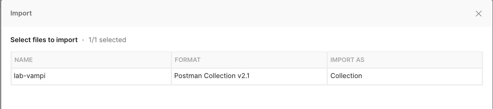

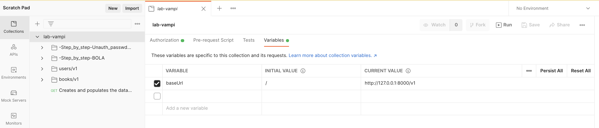

## Vulnerabilities we will simulate

### Broken Object Level Authorization
Steps to reproduce:
1. Open the Postman collection and head to the folder **-Step_by_step-BOLA**
   * You will notice that some of the APIs have the Inherit auth from parent set. You can check the config of the "parent auth" here:
    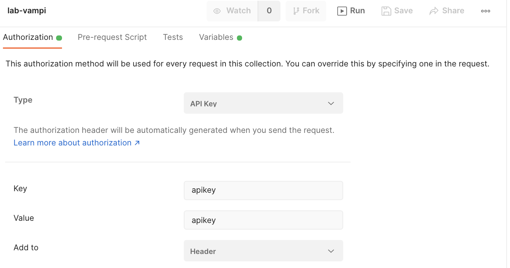
   * Some APIs will have the Bearer Token Auth Type. It will be clear why this is set like this later on.
    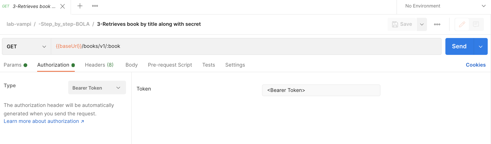
   * the `{{baseUrl}}` is configured to point to your Kong gateway & route 
    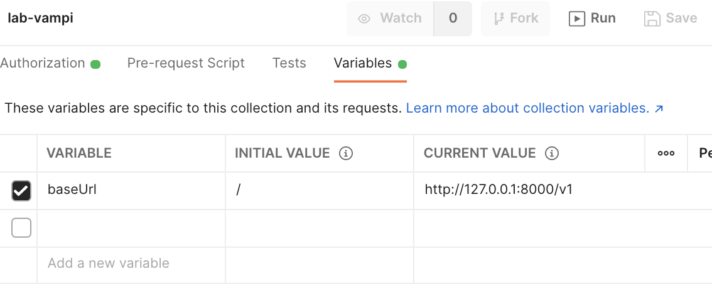
2. Hit the GET `{{baseUrl}}/` endpoint which you can find in the request named `0-Vulernable API - Home`
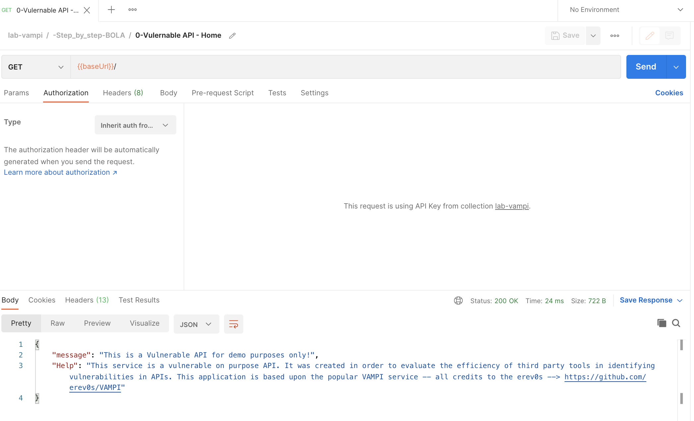
3. Hit the GET `{{baseUrl}}/books/v1` endpoint which you can find in the request named `1-Retrieves all books` and note which book is owned by the individual users.
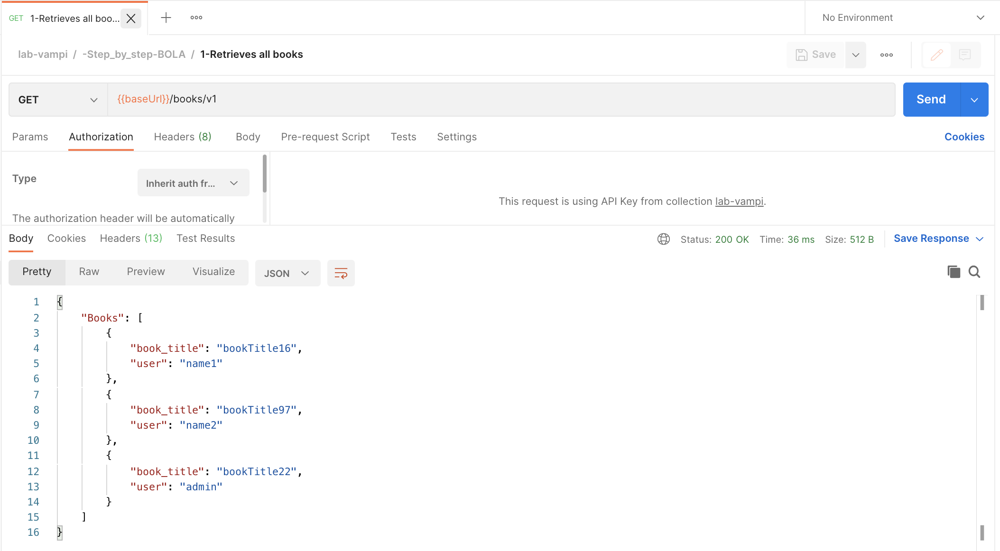
4. Login to the service by hitting the POST  `{{baseUrl}}/users/v1/login` endpoint which you can find in the request named `2-Login to Vulnerable API` Do complete the body of the request with a username and password. Once you hit that, copy the bearer token of the user. 
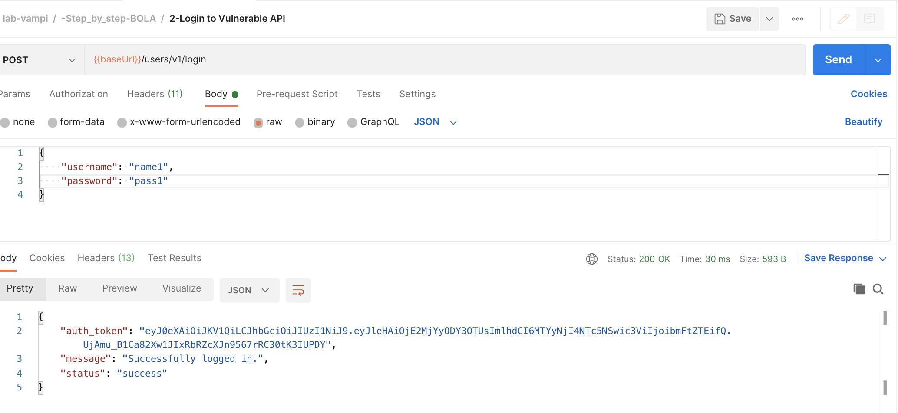
5. Now we are gonna retrieve the book associated with the user **and** the associated secret using the collected Bearer Token by hitting the GET `{{baseUrl}}/books/v1/:book` endpoint. Ensure that you have copied the bearer token in the `Auth Type` and that you have an `apikey:apikey` configured in the headers. You also need to complete the path variable `book` with one of the book titles. 


7. :bomb: **And here come's the BOLA**  :bomb:
    Do exactly as step 6, but now with a book associated to another user. 
    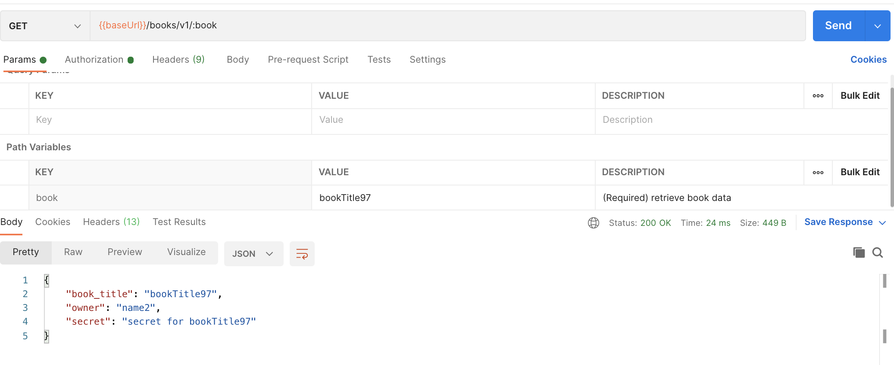
    :warning: BOOM! You also got the secret from someone else.
    So in short: **You are authenticated into the system (bearer token) but you can access non-authorized data!**

### Unauthorized Password Change
Steps to reproduce:
1. Open the Postman collection and head to the folder **-Step_by_step-Unauth_passwd_change**
   * You will notice that some of the APIs have the Inherit auth from parent set. You can check the config of the "parent auth" here:
    
   * Some APIs will have the Bearer Token Auth Type. It will be clear why this is set like this later on.
    
   * the `{{baseUrl}}` is configured to point to your Kong gateway & route 
    
2. Hit the GET `{{baseUrl}}/` endpoint which you can find in the request named `0-Vulernable API - Home`

3. Hit the GET `{{baseUrl}}/users/v1/_debug` endpoint which you can find in the request named `1-Retrieves all details for all users` and note usernames and passwords.
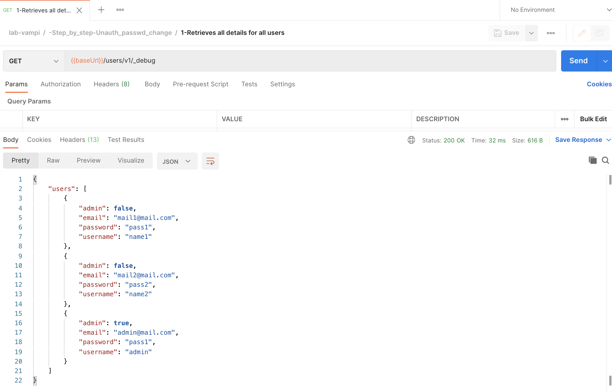
4. Login to the service by hitting the POST  `{{baseUrl}}/users/v1/login` endpoint which you can find in the request named `2-Login to Vulnerable API` Do complete the body of the request with a username and password. Once you hit that, copy the bearer token of the user. 
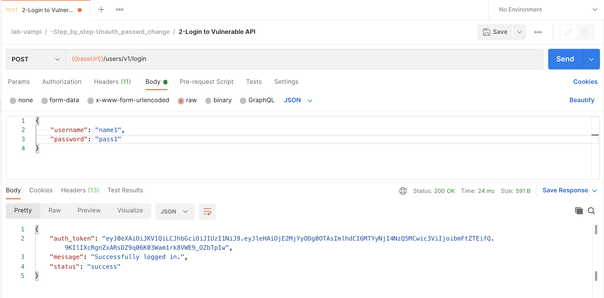
5. :bomb: **And here come's the Unauthorized Password Change** :bomb: 
   Using the collected Bearer Token we are gonna hit the PUT `{{baseUrl}}/users/v1/:username/password` endpoint. Ensure that you have copied the bearer token in the `Auth Type` and that you have an `apikey:apikey` configured in the headers. You also need to complete the path variable `username` with another username then the one you requested the token for.  In the `body` you can enter a `new password`
    
    
    
    
6. You can verify that you were able to successfully change the password from another user by hitting the GET `{{baseUrl}}/users/v1/_debug` endpoint again which you can find in the request named `1-Retrieves all details for all users` and note that you changed the password of another user :scream:
    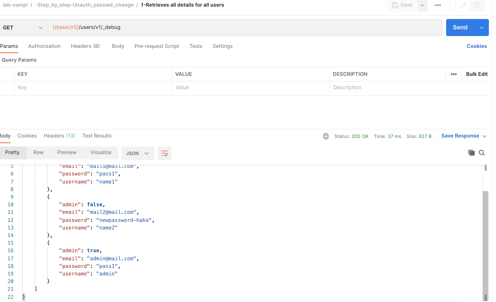